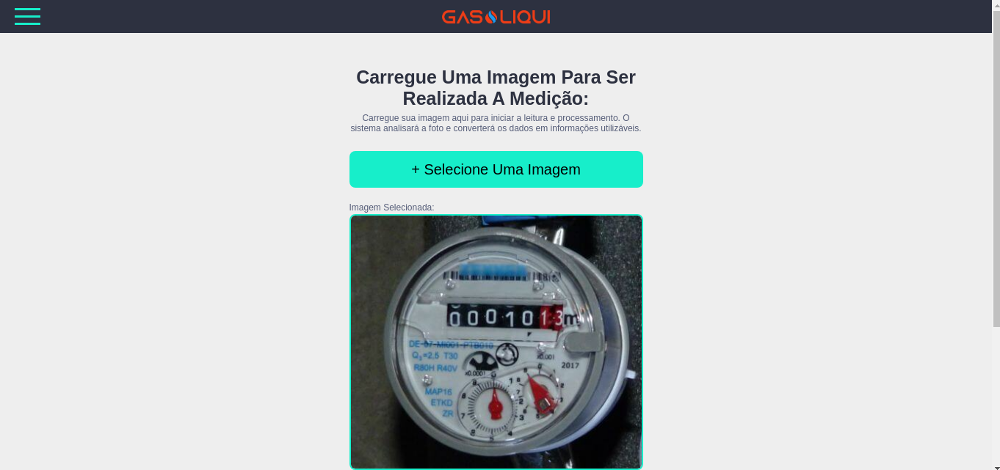
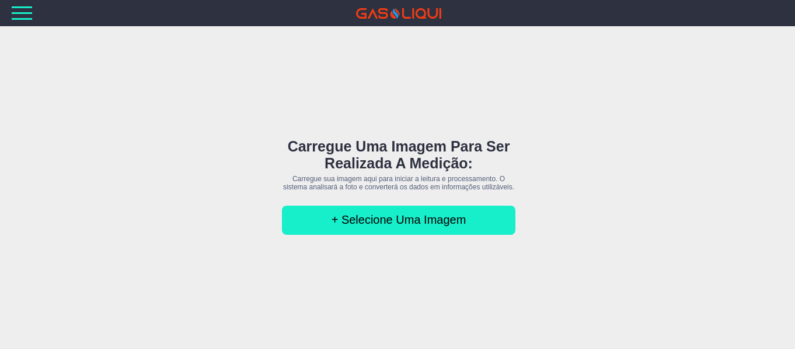
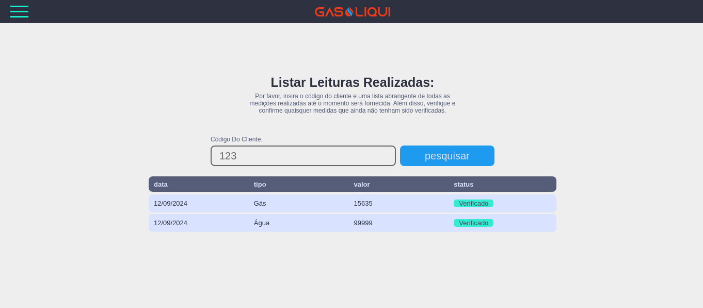

# Frontend for Gasoliqui API

<p align="center">
    </br></br>
    
    
    
    </br></br></br>
</p>

## Description

This project is the frontend for the [Gasoliqui API](#). It utilizes React and TypeScript to create an interactive and efficient interface for visualizing and monitoring water and gas consumption data.

## Technologies

- **React**: A JavaScript library for building user interfaces.
- **TypeScript**: A superset of JavaScript that adds static typing and other features.

## Gasoliqui API

The Gasoliqui API is a robust and efficient solution for reading and monitoring water and gas consumption data. It leverages Google's advanced AI, Gemini, to provide detailed and precise insights.

## Installation

To install and run the project locally, follow these steps:

1. Clone the repository:
    ```bash
    git clone https://github.com/your-username/your-repository.git
    ```

2. Navigate to the project directory:
    ```bash
    cd your-repository
    ```

3. Install the dependencies:
    ```bash
    npm install
    ```

4. Start the development server:
    ```bash
    npm start
    ```

## Contributing

If you would like to contribute to this project, feel free to open an issue or submit a pull request. We appreciate your contributions!

## License

This project is licensed under the [MIT License](LICENSE).
